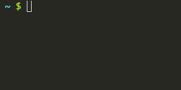

# email-check-cli 

> Checks if an email is valid & real by contacting the associated remote mail server  :email:



*See [email-chk](https://github.com/brandon93s/email-chk) for the programmatic module.*

## Install

```
$ npm install --global email-chk-cli
```


## Usage

```
$ email-chk --help

  Usage
      $ email-chk <email>

  Options
      -t, --timeout   Timeout in ms
      -h, --host      Domain of originating smtp server
      -f, --from      Email originating the request 
```


## Related

- [email-chk](https://github.com/brandon93s/email-chk) - API for this module
- [email-chk-lambda](https://github.com/brandon93s/email-chk-lambda) - Lambda function for this module

## License

MIT © [Brandon Smith](https://github.com/brandon93s)
